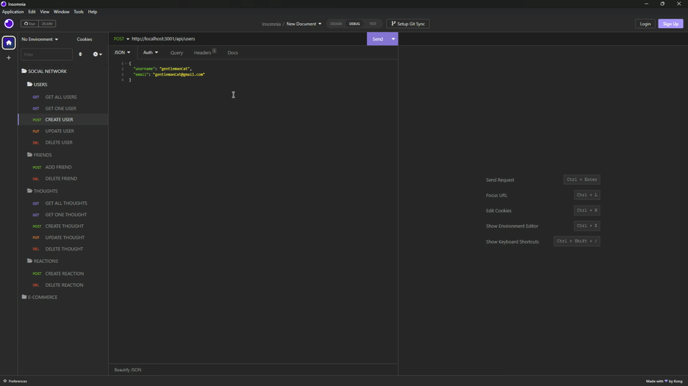
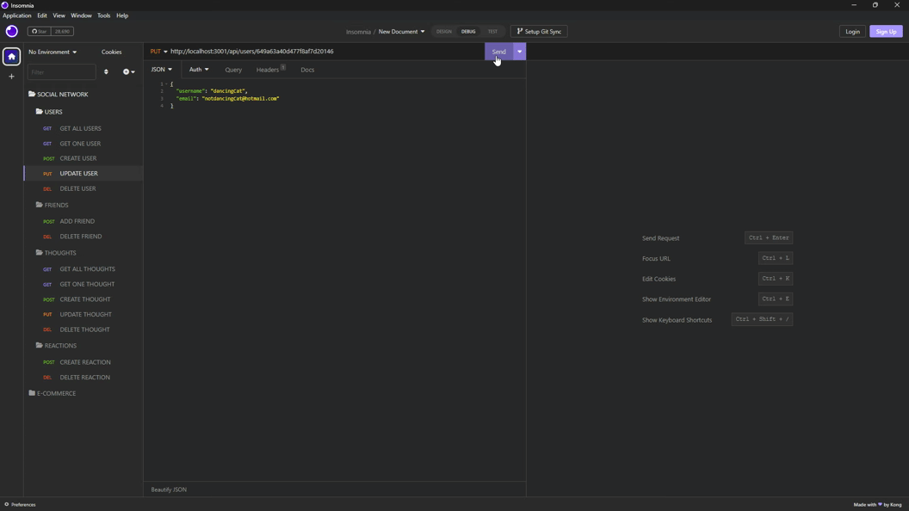

# Social Network API

 

## Description

The goal of this social network API is to develop an application with API routes that enable users to share their thoughts, add friends, and interact by reacting to thoughts.

 

## Table of Contents

- [Description](#description)
- [Table of Contents](#table-of-contents)
- [Demonstration](#demonstration)
- [Technology](#technology)
- [Installation](#installation)
- [Credits](#credits)
- [License](#license)

 

## Demonstration

Application Demonstration:\
Watch it on [Google Drive](https://drive.google.com/file/d/1qlkqXpcp6kbhGJg-RQqgDM76_acSQbQc)🖥️

Application Preview:

 

## Technology

The application utilizes a range of technogies to delivere its functionality. These include:

- Back-End Technologies:

  - Node.js
  - Express

- Database:

  - MongoDB

- Object-Document Mapping

  - Mongoose

 

## Installation

Make sure to have Node.js installed on your system.

To install:\
Please refer to the [Node.js](https://nodejs.org/en/download) site.

 

Make sure to have Insomnia installed on your system.

To install:\
Please refer to the [Insomnia](https://insomnia.rest/download) site.

 

Verify that all the necessary dependencies, packages, or modules are properly installed.

To install:

1. Right click on the Main folder and select "Open in Integrated Terminal" in VS Code.
2. Type "npm install" in the terminal.

 

## Credits

The application utilizes a range of dependencies including Node.js, Express, MongoDB, Mongoose and Insomnia to effectively operate the server and showcase it.

 

## License

Please refer to the [LICENSE](https://github.com/ronachen99/social-network-api/blob/main/LICENSE) document.
